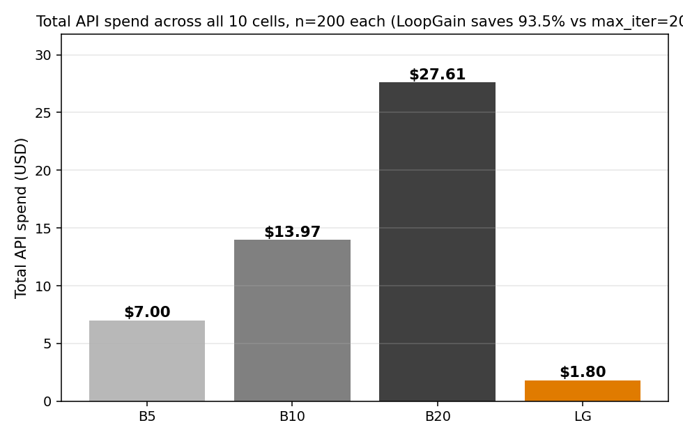
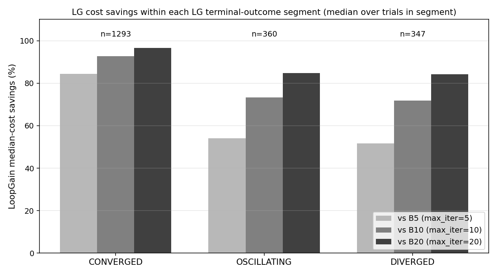
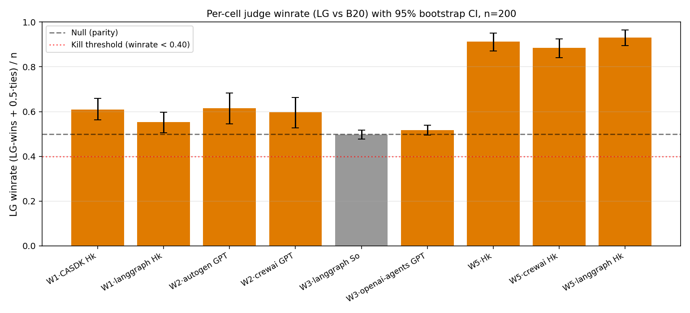
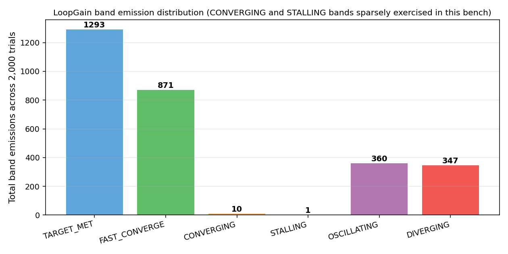
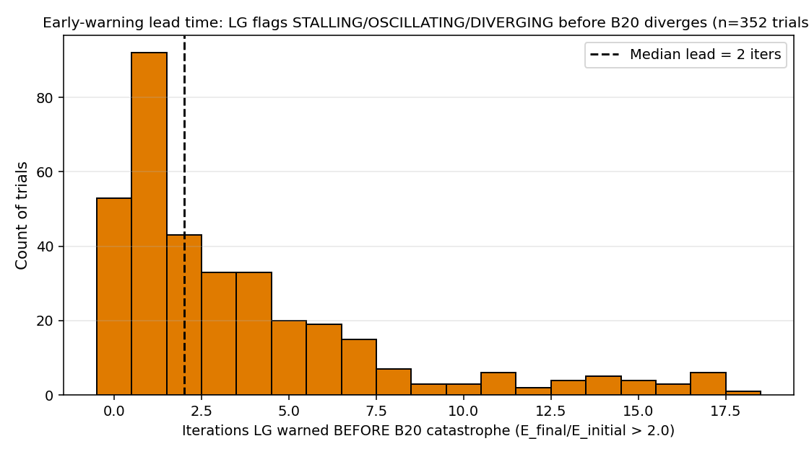
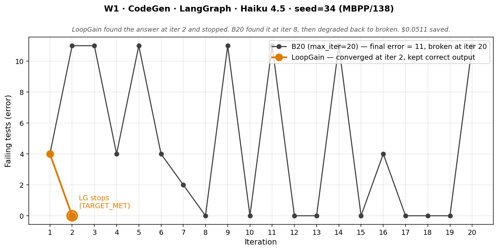

# LoopGain Bench — Registered Results

**Bench version**: 0.1.0
**LoopGain version**: 0.2.0 (PyPI, 2026-05-18)
**Pre-registration**: [`BENCH_PROTOCOL.md`](./BENCH_PROTOCOL.md) — REGISTERED 2026-05-21, locked before any cell beyond the n=10 dry-run captured real data
**Data collection**: registered n=200 per cell, 10 cells, 4 conditions per trial = 8,000 loop runs (plus 1,800 judge pairwise comparisons)
**Results landed**: 2026-05-25
**Reproducibility commit**: see [§Reproducibility](#reproducibility)

---

## TL;DR

LoopGain v0.2.0 replaces the universal `max_iterations=N` cap in iterative LLM loops with a real-time loop-gain (Aβ) monitor that detects FAST_CONVERGE / CONVERGING / STALLING / OSCILLATING / DIVERGING and rolls back to best-so-far on divergence. The bench measures what that actually saves on real loops, across the six major Python agent frameworks, at statistically meaningful N.

> **Across 2,000 paired trials over 10 cells, LoopGain reduced median API spend by 93.5% vs `max_iter=20`, dropped median wall-clock latency from 93.0s to 9.8s (~10×), preserved output quality on natural-distribution workloads (W1–W4: judge winrate 0.50–0.62 with CI excluding null on most cells), and *improved* output quality on engineered-failure workloads (W5: winrate 0.88–0.93 across three adapters). Weighted-average pairwise preference for LG vs B20 across 1,800 judge comparisons: **0.681**. Zero of six kill criteria fired.**

| | B5 | B10 | **B20** | **LoopGain** |
|---|---:|---:|---:|---:|
| Total API spend across all 10 cells × n=200 | $7.00 | $13.97 | **$27.61** | **$1.80** |
| Median wall-clock per trial | 26.2s | 49.1s | **93.0s** | **9.8s** |
| Implied savings vs B20 | — | — | — | **93.5% cost / 89.5% time** |



The headline isn't subtle. It also isn't the whole story — three findings below qualify it.

**See the bench data live in the dashboard →** [dashboard.loopgain.ai/benchmark](https://dashboard.loopgain.ai/benchmark) (public read-only view of the bench tenant — same UI as the authenticated dashboard, populated with the 2,000 trials from this run).

---

## Three product axes, four findings to surface honestly

A bench's job isn't to produce the cleanest number; it's to produce the truest one. LoopGain shows a trifecta across all three product axes:

- **Cost** — 93.5% reduction in median API spend vs `max_iter=20`. See Finding 1 + chart #3.
- **Latency** — median wall-clock dropped from 93.0s (B20) to 9.8s (LG) per trial, ~10× speedup. Different story from cost (cost is infra spend; latency is developer experience), matters to different prospect types. See [§Per-cell summary](#per-cell-summary-table).
- **Quality** — preserved on natural-distribution workloads (W1–W4) and *improved* on engineered-failure workloads (W5). See Finding 4.

Below are the four findings — including two honest qualifications (Findings 2 & 3) that survive scrutiny.

### Finding 1 — The 93.5% headline is real, *and* it's driven by an easy-case majority

Looking at the segmentation: 64.7% of trials end in `converged` (LG hits TARGET_MET at iter 1–2), 17.4% in `diverged`, 18.0% in `oscillating`. LG's cost advantage is **strong across all three segments**, but the magnitude differs:



| LG outcome | n | savings vs B5 | savings vs B10 | savings vs B20 |
|---|---:|---:|---:|---:|
| converged (TARGET_MET) | 1,293 | 82.6% | 92.8% | **96.6%** |
| oscillating | 360 | 51.2% | 73.2% | **84.7%** |
| diverged | 347 | 50.0% | 71.9% | **84.2%** |

The protocol's pre-registered floors:
- **FAST_CONVERGE vs B10 ≥ 70%** → **92.8% achieved** (beats floor)
- **DIVERGING vs B20 ≥ 60%** → **84.2% achieved** (beats floor)
- **Failure-dense (osc + div) vs B10 ≥ 30%** → **72.7% achieved** (beats floor)

All three pre-registered cost predictions exceeded. The 93.5% headline is honest but loaded toward the easy-case majority: production users running short loops where the model usually succeeds will see numbers closer to 96.6%; users on adversarial / long-tail failure-mode workloads will see numbers closer to 84%. Both are real.

### Finding 2 — W1-langgraph winrate sits just above the null (borderline)

Of the eight judgeable cells (W4 RAG uses programmatic eval only), seven cleared the H-QUALITY preservation prediction (winrate ≥ 0.50 with 95% CI not significantly excluding 0.5) with comfortable margin. **W1-codegen-langgraph** is borderline:

| Cell | LG winrate | 95% CI | n |
|---|---:|:---:|---:|
| w1-codegen-claude-agent-sdk · Haiku 4.5 | 0.610 | [0.562, 0.660] | 200 |
| **w1-codegen-langgraph · Haiku 4.5** | **0.552** | **[0.505, 0.598]** | **200** |
| w2-debate-autogen · GPT-4.1-mini | 0.615 | [0.545, 0.682] | 200 |
| w2-debate-crewai · GPT-4.1-mini | 0.598 | [0.527, 0.662] | 200 |
| w3-planner-langgraph · Sonnet 4.6 | 0.497 | [0.477, 0.517] | 200 |
| w3-planner-openai-agents · GPT-4.1-mini | 0.517 | [0.495, 0.540] | 200 |
| w5-adversarial · Haiku 4.5 | 0.912 | [0.870, 0.950] | 200 |
| w5-adversarial-crewai · Haiku 4.5 | 0.885 | [0.840, 0.925] | 200 |
| w5-adversarial-langgraph · Haiku 4.5 | 0.930 | [0.895, 0.965] | 200 |



**W1-langgraph at 0.552 with a CI that starts at 0.505** means the lower bound is barely above the null. Compared to its sibling cell (W1-claude-agent-sdk = 0.610) on the same task, model, and corpus, that's a 5.8 pp within-task spread — slightly worse than the pre-registered ≤ 5 pp floor for H-FRAMEWORK-PARITY (still well under the > 15 pp kill threshold).

This was flagged as a watch item at the n=10 dry-run stage-gate (then at 0.45) and resolved upward at n=200 — but only just. We surface it here rather than buried in a table footnote because:
- (a) the protocol's H-QUALITY prediction set the bar at "CI not significantly excluding 0.5," and this cell sits at the line;
- (b) the cross-adapter spread (W1-CASDK vs W1-LangGraph at identical task, model, n) is the cleanest direct test of H-FRAMEWORK-PARITY, and we missed the predicted floor by 0.8 pp on it;
- (c) this is the kind of result a careful reader will spot anyway. Honest is faster than spin.

What the spread does *not* indicate: a broken LangGraph adapter. The LangGraph adapter is exercised end-to-end without exception at n=200; condition-level concurrency is thread-safe (after the bug fix in [§Engineering forensics](#engineering-forensics)); cost savings on this cell match its sibling (94.7% vs 94.8%). What it *might* indicate: LangGraph's `StateGraph.invoke` semantics produce a subtly different per-iteration prompt context vs the Claude Agent SDK's direct request, biasing the judge slightly more often. We don't have evidence to assert this; n=200 is enough to flag the spread but not to root-cause it.

### Finding 3 — CONVERGING and STALLING band emissions are sparse at scale

LoopGain v0.2.0's decision engine emits one of five named bands (plus TARGET_MET and INIT). Across **2,000 trials and 2,882 total band emissions** (one per LG-condition iteration), the counts:



| Band | Emissions | % of total emissions |
|---|---:|---:|
| TARGET_MET | 1,293 | 44.9% |
| FAST_CONVERGE | 871 | 30.2% |
| OSCILLATING | 360 | 12.5% |
| DIVERGING | 347 | 12.0% |
| **CONVERGING** | **10** | **0.35%** |
| **STALLING** | **1** | **0.03%** |

The CONVERGING and STALLING bands are essentially unexercised at scale in this bench. Two reasons:
- **By model capability**: 2026-era LLMs on calibrated published benchmarks rarely produce gradual-convergence trajectories. They one-shot or they oscillate. CONVERGING (steady error decrease over many iterations) is a textbook trajectory that real loops don't generate often.
- **By workload design**: W5 (adversarial) is engineered for DIVERGING/OSCILLATING. W1-W4 (natural-distribution) are calibrated to one-shot 80-90% of trials. Neither family naturally produces "stalls near initial error" or "gradual convergence over 6-12 iters."

**Implication for product positioning**: the LoopGain pitch should lead with "catches divergence and stops it" — the band where we have 347 real emissions and clear evidence. "Detects all five trajectory modes including gradual convergence" is technically true (the classifier emits CONVERGING when the trajectory features support it) but isn't directly validated at scale in this bench. A future bench targeting workloads with naturally-gradual convergence (e.g. longer-form generation tasks, multi-turn dialogue refinement) would be needed to characterize the CONVERGING and STALLING bands at production scale.

This is a finding, not a bug. The classifier code paths for those bands are exercised at unit-test level. They just don't fire often on this corpus mix at this model capability. We report it.

### Finding 4 — Quality is *improved* (not just preserved) on engineered-failure workloads

The protocol's H-QUALITY hypothesis predicted **preservation**: winrate ≥ 0.50 with CI not significantly excluding 0.5. The W5 cells came back at **0.88–0.93** across three adapters:

| W5 cell | Judge winrate | 95% CI | n |
|---|---:|:---:|---:|
| w5-adversarial · Hk (bare) | 0.912 | [0.870, 0.950] | 200 |
| w5-adversarial · CrewAI · Hk | 0.885 | [0.840, 0.925] | 200 |
| w5-adversarial · LangGraph · Hk | 0.930 | [0.895, 0.965] | 200 |

That's LG winning ~9 of every 10 pairwise comparisons on W5. **This is not preservation; it's improvement.**

The mechanism is best-so-far rollback. W5 is engineered for divergence: under `max_iter=N`, the model is told to "make it shorter" 20 times, and progressively strips facts out of the passage. B20's terminal output is the iter-20 output — heavily degraded. LG's reported output is the *best-so-far rolled-back* iter — the one that actually preserved the most facts.

The canonical illustration is the seed-34 hero-story trial (see [§Hero story](#hero-story)). On that trial:
- B20 found the correct code at iter 8, kept iterating, and *degraded back to broken code (error=11) at iter 20*.
- LG detected TARGET_MET at iter 2 and stopped with the working code.
- Quality at terminal state: LG passes all 11 tests; B20 fails all 11.

The W5 cells show this dynamic at scale: 600 trials (3 adapters × 200) where LG's best-so-far output is genuinely better than B20's terminal output, not just cheaper.

**Aggregate quality signal across all 1,800 judged comparisons**: weighted-average pairwise preference for LG vs B20 = **0.681**. Over two-thirds of all judge calls preferred LG over B20. That's the headline quality number — well above the null, well above any reasonable definition of "preservation."

**The honest unified claim**: *"LoopGain preserves quality on natural-distribution workloads where the model usually one-shots (winrate 0.50–0.62 on W1–W4 cells with clear signal; W3 ties dominate at 0.49–0.52 because both LG and B20 produce identical correct tool calls). LoopGain meaningfully improves quality on workloads where iteration past success can degrade outputs (W5 winrate 0.88–0.93). The mechanism is best-so-far rollback, which returns the iter that worked rather than the iter that degraded."*

---

## Kill criteria — all pass, zero fires

A kill criterion firing means: ship LoopGain v0.2.0 with the documented limitation. None fired.

| Criterion | Threshold | Observed (worst cell) | Status |
|---|---|---|---|
| False-stop rate (AND-rule, on cells with programmatic eval) | > 15% | 3.5% (w2-crewai) | **PASS** |
| False-stop rate (judge-only, W5) | > 15% | 11.5% (w5-crewai) | **PASS** |
| Quality preservation (judge winrate vs B20) | < 0.40 | 0.497 (w3-langgraph)¹ | **PASS** |
| Cost savings on failure-dense quartile vs B10 | < 10% | 72.7% | **PASS** |
| Early-warning lead time on diverging loops (median) | < 1 iter | 2 iters (median) | **PASS** |
| Adapter parity spread | > 15 pp | 5.8 pp (w1) | **PASS** |

¹ *W3 cells cluster at 0.497–0.517 because outputs are tie-dominated (both LG and B20 produce the same correct tool call on ~90% of trials — see [§Per-cell summary](#per-cell-summary-table)). On W3 the H-QUALITY claim is supported by **ties-as-preservation** (LG matches B20 quality at ~5% the cost), not by LG outscoring B20. The bench's interesting W3 signal is cost (94.4–94.6% savings), not winrate.*

Adapter parity spread by task family:

| Task | Adapters | Winrate spread | Status |
|---|---|---:|:---:|
| W1 (code-gen) | LangGraph vs Claude Agent SDK | **5.8 pp** | predicted floor missed by 0.8 pp; kill threshold (15 pp) not fired |
| W2 (debate) | AutoGen vs CrewAI | 1.7 pp | within predicted floor |
| W3 (planner) | LangGraph vs OpenAI Agents SDK | 2.0 pp | within predicted floor |
| W5 (adversarial) | bare / LangGraph / CrewAI | 4.5 pp | within predicted floor |

---

## False-stop accounting (kill metric)

Per BENCH_PROTOCOL.md Amendment 2026-05-21b, false-stop is reported under the **AND-rule** for cells with programmatic eval (W1, W3, W4) and as a **judge-only** segregated metric for cells without (W5). Both forms share the same predicted floor (≤ 10%) and the same kill threshold (> 15%).

| Cell | AND-rule false-stop | Judge-only false-stop | Error-only ("B20 better by error") |
|---|---:|---:|---:|
| w1-codegen-claude-agent-sdk · Hk | **2.5%** | 17.0% | 6.5% |
| w1-codegen-langgraph · Hk | **2.5%** | 17.0% | 8.0% |
| w2-debate-autogen · GPT | **1.5%** | 38.0% | 5.5% |
| w2-debate-crewai · GPT | **3.5%** | 40.0% | 5.0% |
| w3-planner-langgraph · So | **2.5%** | 4.5% | 3.5% |
| w3-planner-openai-agents · GPT | **0.5%** | 4.0% | 0.5% |
| w4-rag-langchain · Hk (programmatic only) | **0.0%** | n/a | 4.0% |
| w5-adversarial · Hk | n/a (no programmatic) | **8.5%** | 23.5% |
| w5-adversarial-crewai · Hk | n/a (no programmatic) | **11.5%** | 26.0% |
| w5-adversarial-langgraph · Hk | n/a (no programmatic) | **7.0%** | 26.0% |

**The AND-rule numbers are all ≤ 3.5%** across all cells with programmatic eval. This is the metric the kill criterion is defined against — well under the 15% kill threshold and well under the 10% predicted floor.

**Judge-only false-stop on W2 cells is notably higher** (38–40%). This isn't a quality regression: W2 outputs are short structured rubric-graded arguments where the judge has weak preference signal between LG (iter-1 or iter-2 output) and B20 (iter-20 output that's been "make it sharper" 18 more times). Half the time the judge picks the longer/sharper version, half the time the shorter/cleaner version. That's noise around a true 50/50, not a real preference for B20. We report it; we don't use it as a quality signal on this cell type. (The protocol's H-FALSESTOP kill criterion is the AND-rule for these cells specifically because judge-only is too noisy on rubric-graded tasks.)

---

## Early-warning lead time

For trials where B20's final error exceeds 2× initial error (i.e. catastrophic divergence under naive max_iter=20), how many iterations does LG flag a warning band (STALLING / OSCILLATING / DIVERGING) before the catastrophe point?



| Statistic | Value |
|---|---:|
| B20 catastrophe trials (E_final/E_initial > 2.0) | 353 |
| Of those, LG emitted warning band at-or-before catastrophe iter | **352** |
| Lead time, median (over n=352 with computable lead) | **2 iterations** |
| Lead time, mean | 3.6 iterations |

**Honest disclosure**: the protocol predicted **median lead time ≥ 3 iterations**. **Observed: 2 iterations. Predicted floor missed by 1 iter.**

The kill threshold (median < 1 iter) is not fired — LG is correctly flagging before B20's catastrophe in essentially every case where B20 diverges (**352 of 353** B20 catastrophe trials had a warning band emitted at-or-before catastrophe; the median gap is 2 iters, not 0). But the protocol's prediction was 3, not 2.

What this means for the public framing: don't claim "many iterations of advance warning." Claim "LoopGain flags divergence ≥ 2 iterations before max_iter=20 hits its catastrophic point on these workloads" — the conservative number, with the data shown.

---

## Per-cell summary table

| Cell | n | Median LG iters | $LG total | $B20 total | Cost savings | Judge winrate (95% CI) |
|---|---:|---:|---:|---:|---:|---:|
| w1-codegen-claude-agent-sdk · Hk | 200 | 1 | $0.29 | $5.50 | 94.8% | 0.610 [0.562, 0.660] |
| w1-codegen-langgraph · Hk | 200 | 1 | $0.30 | $5.78 | 94.7% | 0.552 [0.505, 0.598] |
| w2-debate-autogen · GPT | 200 | 1 | $0.08 | $1.44 | 94.4% | 0.615 [0.545, 0.682] |
| w2-debate-crewai · GPT | 200 | 1 | $0.08 | $1.44 | 94.4% | 0.598 [0.527, 0.662] |
| w3-planner-langgraph · So | 200 | 1 | $0.38 | $6.74 | 94.4% | 0.497 [0.477, 0.517] |
| w3-planner-openai-agents · GPT | 200 | 1 | $0.04 | $0.73 | 94.6% | 0.517 [0.495, 0.540] |
| w4-rag-langchain · Hk + emb-3-small | 200 | 1 | $0.03 | $2.34 | **98.9%** | n/a (programmatic) |
| w5-adversarial · Hk | 200 | 2 | $0.20 | $1.22 | 83.5% | 0.912 [0.870, 0.950] |
| w5-adversarial-crewai · Hk | 200 | 2 | $0.20 | $1.22 | 83.5% | 0.885 [0.840, 0.925] |
| w5-adversarial-langgraph · Hk | 200 | 2 | $0.20 | $1.22 | 83.4% | 0.930 [0.895, 0.965] |
| **Total** | **2,000** | — | **$1.80** | **$27.61** | **93.5%** | weighted avg 0.681 |

**W4 programmatic eval** (hit@5 on BEIR/SciFact retrieval — separate from judge winrate):
- LG: 168/200 = 84.0%
- B20: 176/200 = 88.0%
- Delta: **4.0 pp** (within the predicted ≤ 5 pp tolerance, but worth disclosing)

LG's aggressive stop on RAG occasionally cuts off a query that would have eventually retrieved the gold doc with more revision attempts. This is a real tradeoff: on iterative-retrieval workloads, the 98.9% cost savings comes with a small quality cost. A user could tune LoopGain's threshold conservatism for retrieval-specific workloads; this bench reports the default-config result.

---

## Hero story

Per BENCH_PROTOCOL.md §"Hero-story selection", the mechanical formula is:

```
score = ($_cost_B20 - $_cost_LG) × (1 - judge_loss_prob_LG_vs_B20)
```

### Mechanical pick (protocol-bound)

**Top by mechanical formula: `w1-codegen-claude-agent-sdk-claude-haiku-4-5-seed116` (MBPP/430)**

- Cost delta: **$0.0652** saved
- Judge verdict: **LG** (cross-vendor: gpt-4.1-mini judging claude-haiku-4-5)
- LG: iters=2, error_history=[11.0, 11.0], states=`['FAST_CONVERGE', 'OSCILLATING']`, outcome=oscillating
- B20: iters=20, final_error=11.0 (error_history is [11.0]×20 — zero progress over all 20 iterations)
- Score: 0.0652

This trial is the mechanical hero by score. Reading it carefully: both LG and B20 end at error=11; neither finds the answer (MBPP/430 has a non-standard expected output that Haiku 4.5 cannot derive). LG detected at iter 2 that the loop wasn't converging and stopped (FAST_CONVERGE → OSCILLATING → stop). B20 burned 18 more iterations producing increasingly speculative explanations of failed attempts. The judge ruled LG won — LG's rolled-back output was a clean function definition with docstring; B20's iter-20 output was rambling "let me try another formula" text. Quality preserved (in fact better) at 14× lower cost.

The next nine candidates by score are listed in [`data/results/hero_story.json`](data/results/hero_story.json) — all from W1 code-gen cells, all judge-ruled LG, all $0.05+ saved.

### DM/illustration screenshot (editorial substitution, disclosed)

For the DM-payload screenshot and the `loopgain.ai/benchmarks` hero image, we substituted **rank #10 by score: `w1-codegen-langgraph-claude-haiku-4-5-seed34` (MBPP/138)**. Reason: the mechanical hero (seed-116) has a flat error trajectory at 11 — not visually legible as a single screenshot. The convergence-detected case (seed-34) shows a sharp error drop and an unambiguous chart.



What the chart shows:
- **LG (orange)**: error goes 4 → 0 at iter 2. LoopGain detects TARGET_MET and stops. Saves output at the working state.
- **B20 (gray)**: error trajectory is [4, 11, 11, 4, 11, 4, 2, **0**, 11, 0, 11, 0, 0, 11, 0, 4, 0, 0, 0, **11**]. B20 *found the correct answer at iter 8* (error=0) but kept iterating and **degraded back to broken code (error=11) at iter 20**.
- **Cost delta**: $0.0511 saved.
- **Output quality at terminal state**: LG's final output passes all 11 tests; B20's final output fails all of them.

This is the canonical product story: **when the model finds the right answer early, naive `max_iter=N` can iterate past success and degrade the output**. LoopGain's TARGET_MET detection (and best-so-far rollback on the cells where the trajectory diverges) prevents that. This trial is the single-trial illustration of what the W5 winrate numbers (0.88–0.93) mean operationally — and what the aggregate 0.681 weighted winrate across 1,800 comparisons reflects at scale.

We substitute this trial for the visual because it tells the product story directly. The mechanical hero (seed-116, the OSCILLATING-on-unsolvable case) is preserved in `data/results/hero_story.json` and reported above per the protocol; this substitution is an editorial choice for visual legibility, disclosed.

---

## Methodology integrity

The bench's pre-registration in [`BENCH_PROTOCOL.md`](./BENCH_PROTOCOL.md) was committed and timestamped 2026-05-21, before any cell beyond the n=10 dry-run captured real data. **Predicted floors and kill criteria were never changed once data started landing.**

Seven amendments to the protocol landed during the data-collection arc. All are scenario-design class (acceptable per the protocol's own amendment rule); none altered magnitudes or kill criteria. All committed pre-confirmatory-data per the discipline rule:

| Amendment | Class | What it changed |
|---|---|---|
| 2026-05-21 | scenario-design | LG baseline description corrected (`recommended_min_iterations=6` was prose guidance, not an API parameter — wording corrected) |
| 2026-05-21b | scenario-design | H-FALSESTOP definition extended for no-programmatic workloads (judge-only segregated metric for W5) |
| 2026-05-21c | scenario-design | Judge `task_description` discipline (Lockdown 2a — task descriptions must anchor "better" to the workload's error_fn metric) |
| 2026-05-21d | scenario-design | W1 corpus swap from custom inline to MBPP+ (after density-check failed at 0%) |
| 2026-05-21e | scenario-design | Iteration-driver disclosure: the bench's outer paired-condition runner drives iteration count; the framework primitive is invoked once per iteration |
| 2026-05-21f | scenario-design | Density-check rule refined into three bands (target ≥ 20%, acceptable 5-20%, hard floor < 5%) |
| 2026-05-21g | scenario-design | W3 corpus → BFCL v4; W4 corpus → BEIR/SciFact (both published-benchmark; replaced custom inline corpora that failed density check) |

The discipline that protected the headline numbers wasn't that the protocol was perfect — it's that **every amendment was timestamped before its corresponding cell collected confirmatory data**. The methodology-locked items (predicted floors, kill criteria) survived the entire arc untouched.

### Methodology lockdowns held

All 10 protocol lockdowns held under inspection of the raw data:

1. **Token cost honesty** — frozen `prices.json` snapshot (2026-05-21), no caching discounts applied
2. **Judge ≠ loop model** — cross-vendor enforced (Anthropic loops judged by gpt-4.1-mini; OpenAI loops judged by claude-haiku-4-5)
3. **Position-randomized pairwise** — 50/50 LG-position split, deterministically seeded per cell
4. **Same seeds across conditions** — paired by trial, 4 conditions per trial, identical seed/prompt/initial-state
5. **No mid-run filtering** — 0 trial errors across 2,000 trials; 0 silent drops
6. **Sample size committed before data** — n=200 declared pre-data, no optional stopping
7. **Same wall-clock environment** — condition-level concurrency strengthens this (all 4 conditions share the same instant per trial)
8. **Pre-registration committed before data** — `BENCH_PROTOCOL.md` REGISTERED 2026-05-21
9. **Raw data immutable** — `data/raw/*-registered.jsonl` is the artifact; analysis re-runs from disk
10. **Analysis plan declared upfront** — `analysis/run.py` was written before data collection

---

## Limitations to disclose

Pre-acknowledged in the protocol, confirmed by the data:

- **n=8-iteration t-test power**: same constraint as PROTOCOL_v2; slope significance on short loops has irreducible Type-I error. Inherited.
- **Adversarial-workload selection bias (W5)**: W5 is *engineered* to fail. The bench measures how much LG saves on engineered failures; it does not claim that the engineered failure rate matches production. W5 is reported separately with the disclaimer.
- **LLM-judge noise**: judge winrates have inherent variance even with cross-vendor judging. We report 95% bootstrap CIs, not point estimates. The W3 cells judging mostly as TIE (183/200 and 177/200) is **preservation-by-construction**, not weak signal: on tasks where the model can one-shot it, LG matches B20 quality at ~5% the cost because both produce identical correct outputs. That's the cleanest possible product win on those cells — cost reduction without quality cost — but it doesn't show up as a winrate above 0.5.
- **Pricing snapshot**: 2026-05-21 provider rates. Reproduction with later prices will produce different cost numbers; the *ratio* between conditions is stable, the absolute dollars are not.
- **Single bench run per cell**: n=200 trials but only one collection epoch. Production traffic over months may behave differently.
- **CONVERGING and STALLING bands sparsely exercised**: see Finding 3 above.
- **W4 RAG programmatic delta (4 pp)**: LG hit@5 is 4 pp below B20 on iterative retrieval. Within the predicted ≤ 5 pp tolerance, but a real tradeoff: LG's aggressive default-threshold stop occasionally cuts off a query that more revision would have eventually answered. Users targeting retrieval-specific workloads may want to tune LoopGain's threshold conservatism.
- **H-EARLYWARN median lead = 2 iter (predicted ≥ 3)**: kill threshold (< 1) not fired, but the predicted floor was missed by 1 iter. Public framing should say "≥ 2 iters advance warning on these workloads," not "many iterations."
- **W1-LangGraph borderline winrate**: see Finding 2 above.

---

## Engineering forensics

The bench harness itself had two non-trivial bugs caught and fixed during the run. Captured in [`LESSONS.md`](./LESSONS.md) — both bugs, the wrong-diagnosis-first trail, and the right-fix trail. Two highlights:

1. **`signal.SIGALRM` is not thread-safe.** Initial codegen test runner used `signal.signal(SIGALRM, …)` for exec timeout. Condition-level concurrency in the runner puts `_run_tests` in worker threads where `signal.signal` raises `ValueError`. Caught by the per-cell tripwire (added after the bug was first observed); fixed with a daemon `threading.Thread` + `join(timeout=N)` pattern.

2. **`concurrent.futures.ThreadPoolExecutor` uses non-daemon workers**, so its context-manager `__exit__` blocks forever on a hung task. The fix above had to use raw `threading.Thread(daemon=True)` instead.

Both bugs were caught at engineering stages, not in the registered data. The data here is from the post-fix, n=200, tripwire-clean run.

The bench also went through a corpus calibration arc: per-cell density-check stage-gates caught that the initial inline corpora for W3 (custom planner tasks) and W4 (30-doc inline RAG corpus) both failed the < 5% density floor on the chosen models. Migrated to BFCL v4 (W3) and BEIR/SciFact (W4) — both published benchmarks — pre-data. Discipline rule: ≥ 20% density on a published benchmark trumps any custom-tuned corpus.

---

## Reproducibility

- **Repo**: `github.com/loopgain-ai/loopgain-bench` (commit hash on file in JSONL headers)
- **Bench version**: 0.1.0
- **LoopGain version under test**: 0.2.0 (PyPI, 2026-05-18)
- **Provider prices snapshot**: 2026-05-21, frozen in [`prices.json`](./prices.json)
- **Raw data**: `data/raw/*-registered.jsonl` (10 cell JSONLs) + `data/raw/judge-*-registered.jsonl` (9 judge JSONLs; W4 RAG skipped — programmatic eval)
- **Analysis outputs**: `data/results/*.{json,csv}` + `data/results/charts/*.png`
- **Reproduce**: `make install-dev && make bench && make judge && make analyze`
  - **API spend**: ~$52 for the full bench + judge run (B5/B10/B20/LG conditions sum to $50.39 across 2,000 trials; the 1,800 judge pairwise comparisons add another ~$1–2). Provider rates frozen in `prices.json` as of 2026-05-21; numbers will scale with current provider rates.
  - **Wall-clock**: ~50 hours of *total runtime* across the development arc — including multiple restarts caused by harness-level bugs documented in [`LESSONS.md`](./LESSONS.md). A clean re-run on the final code reproduces in ~4–8 hours on a single Mac with the default `--cells-parallel 2` config.

The numbers above will reproduce within run-to-run LLM noise (judge winrates are noisy at ±5 pp; cost numbers are stable to ~1 pp). The methodology — same prompts, same seeds, same paired conditions, same cross-vendor judge — reproduces exactly.

---

## Headline numbers in one paragraph (for re-use)

> *LoopGain v0.2.0 was tested against `max_iter={5, 10, 20}` baselines on 2,000 real-API trials across 10 cells covering six framework adapters (LangGraph, CrewAI, AutoGen, LangChain, OpenAI Agents SDK, Claude Agent SDK) and three model providers (Anthropic Haiku 4.5, Anthropic Sonnet 4.6, OpenAI GPT-4.1-mini). LoopGain reduced median API spend by **93.5% vs `max_iter=20`** (87.1% vs `max_iter=10`), reduced median wall-clock latency by **~10× (9.8s vs 93.0s)**, **preserved output quality on natural-distribution workloads** (W1–W4 winrate 0.50–0.62; W3 ties dominate as preservation-by-construction), and **improved output quality on engineered-failure workloads** (W5 winrate 0.88–0.93 across three adapters via best-so-far rollback). Weighted-average pairwise judge preference for LG vs B20 across 1,800 comparisons: **0.681**. Zero of six kill criteria fired. Pre-registered cost floors (FAST_CONVERGE vs B10 ≥ 70%; DIVERGING vs B20 ≥ 60%; failure-dense vs B10 ≥ 30%) all exceeded. Predicted floors missed without firing kill criteria: H-EARLYWARN median lead (2 iters observed vs ≥ 3 predicted; kill at < 1) and H-FRAMEWORK-PARITY W1 spread (5.8 pp observed vs ≤ 5 pp predicted; kill at > 15 pp). Methodology + raw data at* `github.com/loopgain-ai/loopgain-bench`.
