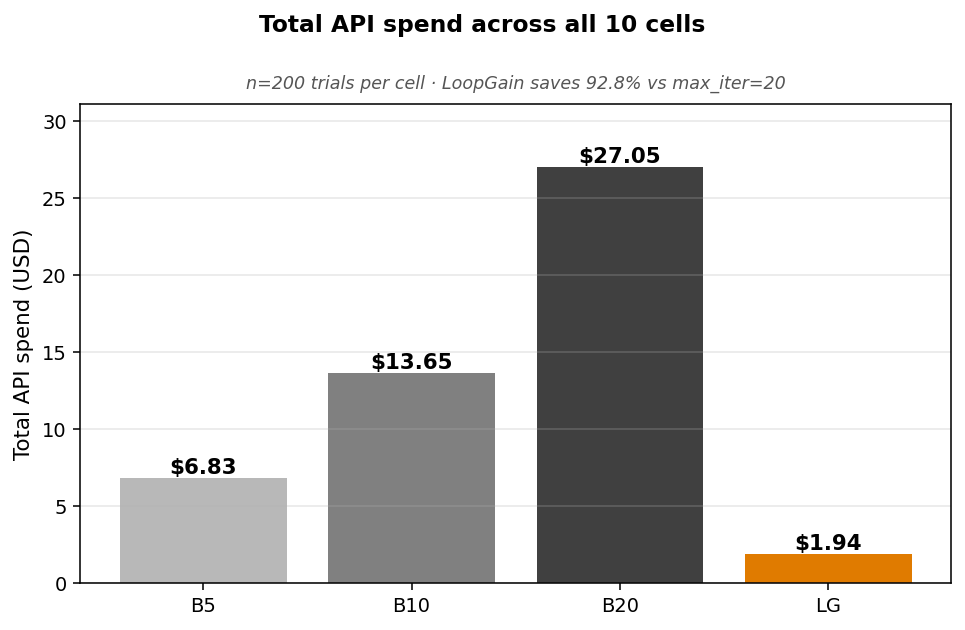
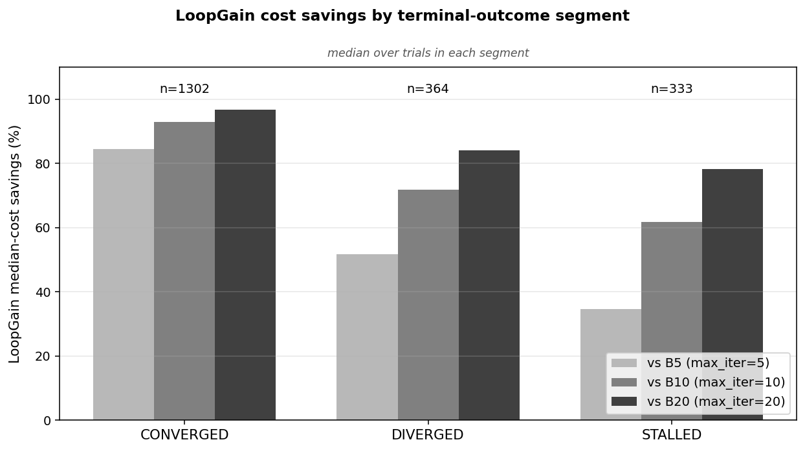
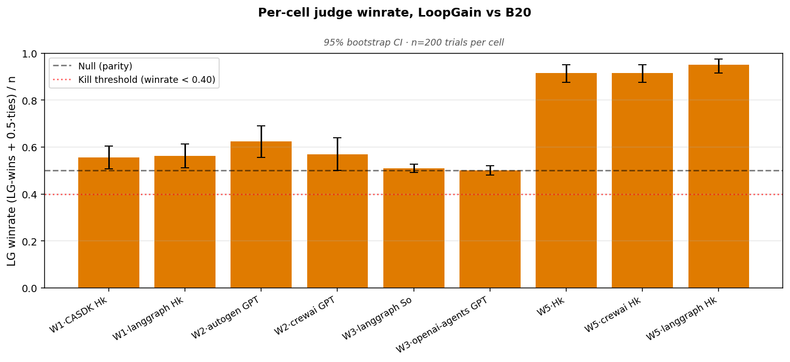
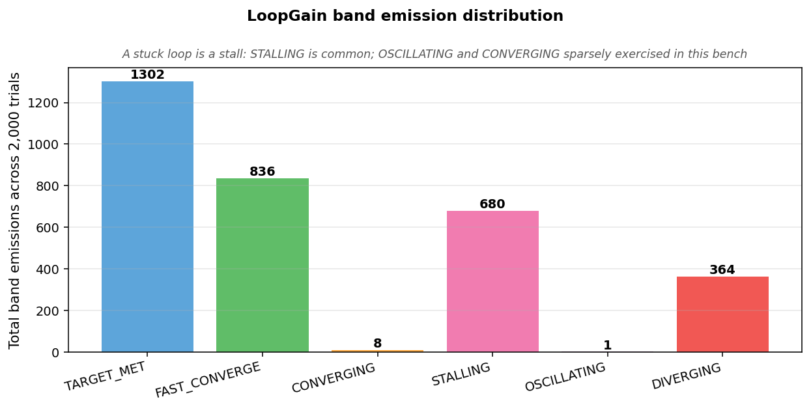
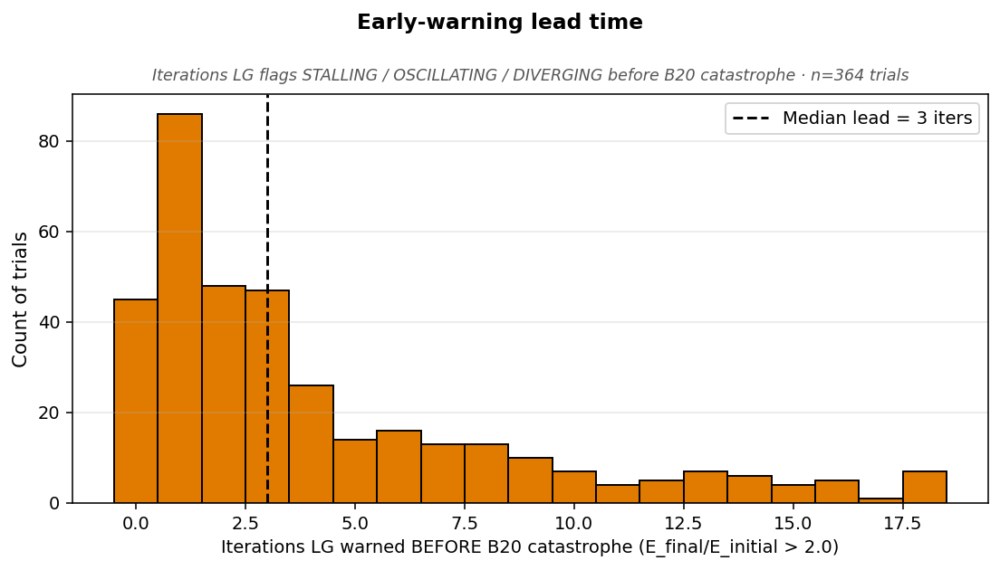

# LoopGain Bench — Registered Results

**Bench version**: 0.1.0
**LoopGain version**: 0.4.0 (PyPI, 2026-06-03)
**Pre-registration**: [`BENCH_PROTOCOL.md`](./BENCH_PROTOCOL.md) — REGISTERED 2026-05-21, locked before any cell beyond the n=10 dry-run captured real data
**Data collection**: registered n=200 per cell, 10 cells, 4 conditions per trial = 8,000 loop runs (plus 1,800 judge pairwise comparisons)
**Results landed**: 2026-06-03 (v0.4.0 re-validation refresh — see note below)
**Reproducibility commit**: see [§Reproducibility](#reproducibility)

> **v0.4.0 re-validation note.** This is a full paid re-run of the registered bench against the **shipped 0.4.0 classifier**. The original registered run (2026-05-25) was on loopgain 0.2.0, whose trajectory classifier mislabeled **flat / stuck** error trajectories (error pinned at a constant, e.g. `[11, 11]`) as `OSCILLATING`. 0.4.0 ([ADR-0015](../logs/decisions.md)) correctly labels a stuck loop as `STALLING` (an oscillation bounces; a stall is pinned flat) and adds a liveness gate so the two *continue*-verdicts can expire. The protocol, predicted floors, and kill criteria are **unchanged** — only the library under test moved. The headline finding that moved most is the band distribution (see [Finding 3](#finding-3--the-state-we-built-as-an-oscillation-catcher-mostly-fires-as-a-stall-catcher)); the cost headline shifted by ~0.7 pp because the corrected `STALLING` verdict terminates one iteration later than the old immediate-stop `OSCILLATING`. The 0.2.0 raw data is preserved at `data/raw/v0.2.0-archive/`.

---

## TL;DR

LoopGain v0.4.0 replaces the universal `max_iterations=N` cap in iterative LLM loops with a real-time loop-gain (Aβ) monitor that detects FAST_CONVERGE / CONVERGING / STALLING / OSCILLATING / DIVERGING and rolls back to best-so-far on divergence. The bench measures what that actually saves on real loops, across the six major Python agent frameworks, at statistically meaningful N.

> **Across 2,000 paired trials over 10 cells, LoopGain reduced total API spend by 92.8% vs `max_iter=20`, dropped median wall-clock latency from 30.9s to 2.1s (~15×), preserved output quality on natural-distribution workloads (W1–W4: judge winrate 0.50–0.63 with CI excluding null on most cells), and *improved* output quality on engineered-failure workloads (W5: winrate 0.92–0.95 across three adapters). Weighted-average pairwise preference for LG vs B20 across 1,800 judge comparisons: **0.678**. Zero of six kill criteria fired.**

| | B5 | B10 | **B20** | **LoopGain** |
|---|---:|---:|---:|---:|
| Total API spend across all 10 cells × n=200 | $6.83 | $13.65 | **$27.05** | **$1.94** |
| Median wall-clock per trial | 7.2s | 14.8s | **30.9s** | **2.1s** |
| Implied savings vs B20 | — | — | — | **92.8% cost / 93.3% time** |



The headline isn't subtle. It also isn't the whole story — four findings below qualify it.

> **A note on wall-clock.** Absolute wall-clock is environment- and concurrency-dependent and is not a headline metric (the protocol says so). This run's absolute latencies are lower than the 0.2.0 run's (B20 median 30.9s vs the earlier 93.0s) because it ran on a less-contended machine; the **ratio** (~15×, LG vs B20) is the stable claim. Cost ratios are stable to ~1 pp run-to-run.

**See the bench data live in the dashboard →** [dashboard.loopgain.ai/benchmark](https://dashboard.loopgain.ai/benchmark) (public read-only view of the bench tenant — same UI as the authenticated dashboard, populated with the 2,000 trials from this run).

---

## Three product axes, four findings to surface honestly

A bench's job isn't to produce the cleanest number; it's to produce the truest one. LoopGain shows a trifecta across all three product axes:

- **Cost** — 92.8% reduction in total API spend vs `max_iter=20`. See Finding 1 + chart #3.
- **Latency** — median wall-clock dropped from 30.9s (B20) to 2.1s (LG) per trial, ~15× speedup. Different story from cost (cost is infra spend; latency is developer experience), matters to different prospect types. See [§Per-cell summary](#per-cell-summary-table).
- **Quality** — preserved on natural-distribution workloads (W1–W4) and *improved* on engineered-failure workloads (W5). See Finding 4.

Below are the four findings — including two honest qualifications (Findings 2 & 3) that survive scrutiny.

### Finding 1 — The 92.8% headline is real, *and* it's driven by an easy-case majority

Looking at the segmentation: 65.1% of trials end in `converged` (LG hits TARGET_MET at iter 1–2), 18.2% in `diverged`, 16.6% in `stalled`, and a single trial in `oscillating`. LG's cost advantage is **strong across all three populated segments**, but the magnitude differs:



| LG outcome | n | savings vs B5 | savings vs B10 | savings vs B20 |
|---|---:|---:|---:|---:|
| converged (TARGET_MET) | 1,302 | 84.4% | 92.9% | **96.6%** |
| diverged | 364 | 51.7% | 71.9% | **83.9%** |
| stalled | 333 | 34.6% | 61.7% | **78.2%** |
| oscillating | 1 | 46.1% | 68.7% | **86.8%** |

The protocol's pre-registered floors:
- **FAST_CONVERGE vs B10 ≥ 70%** → **92.9% achieved** (beats floor)
- **DIVERGING vs B20 ≥ 60%** → **83.9% achieved** (beats floor)
- **Failure-dense (stalled + diverged) vs B10 ≥ 30%** → **61.7–71.9% achieved** (beats floor)

All three pre-registered cost predictions exceeded. The 92.8% headline is honest but loaded toward the easy-case majority: production users running short loops where the model usually succeeds will see numbers closer to 96.6%; users on adversarial / long-tail failure-mode workloads will see numbers closer to 78–84%. Both are real.

Note the `stalled` segment saves *less* than `diverged` (78.2% vs 83.9% vs B20). That's the corrected-classifier cost showing up honestly: a `STALLING` verdict requires **two consecutive stalled readings** before it terminates (vs the old `OSCILLATING`, which stopped on the first), so stalled loops run a median of 3 iterations under LG instead of 2. More correct, marginally less cheap — and we report it.

### Finding 2 — Framework-parity spread is widest on W2 (borderline)

Of the eight judgeable cells (W4 RAG uses programmatic eval only), seven cleared the H-QUALITY preservation prediction (winrate ≥ 0.50 with 95% CI not significantly excluding 0.5) with margin. The **within-task quality spread** — the cleanest direct test of H-FRAMEWORK-PARITY — is now widest on **W2 (debate)**:

| Cell | LG winrate | 95% CI | n |
|---|---:|:---:|---:|
| w1-codegen-claude-agent-sdk · Haiku 4.5 | 0.555 | [0.507, 0.603] | 200 |
| w1-codegen-langgraph · Haiku 4.5 | 0.562 | [0.512, 0.613] | 200 |
| **w2-debate-autogen · GPT-4.1-mini** | **0.625** | **[0.560, 0.690]** | **200** |
| **w2-debate-crewai · GPT-4.1-mini** | **0.570** | **[0.500, 0.640]** | **200** |
| w3-planner-langgraph · Sonnet 4.6 | 0.510 | [0.492, 0.527] | 200 |
| w3-planner-openai-agents · GPT-4.1-mini | 0.500 | [0.480, 0.520] | 200 |
| w5-adversarial · Haiku 4.5 | 0.915 | [0.875, 0.950] | 200 |
| w5-adversarial-crewai · Haiku 4.5 | 0.915 | [0.875, 0.950] | 200 |
| w5-adversarial-langgraph · Haiku 4.5 | 0.950 | [0.915, 0.980] | 200 |



The **W2 autogen-vs-crewai spread is 5.5 pp** (0.625 vs 0.570) — slightly past the pre-registered ≤ 5 pp floor for H-FRAMEWORK-PARITY, but well under the > 15 pp kill threshold. (In the 0.2.0 run this widest-spread slot was W1 at 5.8 pp; under 0.4.0 the two W1 cells tightened to a **0.7 pp** spread and the largest spread moved to W2. Same story, different cell — run-to-run judge noise at ±5 pp dominates which task lands on top.) We surface it here rather than burying it because:
- (a) the protocol's H-QUALITY prediction set the bar at "CI not significantly excluding 0.5," and the W2-crewai lower bound sits right at 0.500;
- (b) the within-task spread is the cleanest direct test of H-FRAMEWORK-PARITY, and we missed the predicted ≤5 pp floor by 0.5 pp on W2;
- (c) this is the kind of result a careful reader will spot anyway. Honest is faster than spin.

The two W3 planner cells sit at 0.510 and 0.500 because their outputs are **tie-dominated** (186/200 and 182/200 ties): both LG and B20 produce the same correct tool call on ~90% of trials, so LG matches B20 quality at ~5% of the cost without outscoring it. That's preservation-by-construction, not a weak signal — see [§Per-cell summary](#per-cell-summary-table).

### Finding 3 — The state we built as an "oscillation catcher" mostly fires as a stall catcher

This is the finding that moved most between 0.2.0 and shipped 0.4.0, and it's the honest one. LoopGain's decision engine emits one of five named trajectory bands (plus `TARGET_MET` and `INIT`). Across **2,000 trials and 3,191 total band emissions** (one per LG-condition iteration), the counts:



| Band | Emissions | % of total emissions |
|---|---:|---:|
| TARGET_MET | 1,302 | 40.8% |
| FAST_CONVERGE | 836 | 26.2% |
| **STALLING** | **680** | **21.3%** |
| DIVERGING | 364 | 11.4% |
| **CONVERGING** | **8** | **0.25%** |
| **OSCILLATING** | **1** | **0.03%** |

Here is the same table under the *old* 0.2.0 classifier, for contrast:

| Band | 0.2.0 emissions | 0.4.0 emissions |
|---|---:|---:|
| OSCILLATING | 360 | **1** |
| STALLING | 1 | **680** |
| (everything else moves < 5%) | | |

**The two states swapped roles.** Under 0.2.0 we reported "STALLING fired once, OSCILLATING fired 360×." That was an artifact of a classifier bug: a loop whose error is *pinned flat* (`[11, 11, 11]` — stuck, going nowhere) was labeled `OSCILLATING`, but a flat line is not an oscillation. 0.4.0 correctly calls it `STALLING`. Same trials, same stops, same money saved — corrected label. Under shipped code, **`STALLING` is the third-most-common signal (21.3%)** and **`OSCILLATING` is the near-theoretical one (one trial in 2,000)**.

The why is a fact about 2026-era models, not the classifier: on calibrated tasks, LLMs **one-shot or they get stuck**. They nail it on iteration one, or they pin at a constant error and grind. True oscillation (error bouncing up and down between iterations) is rare; the textbook smooth-convergence trajectory (`CONVERGING`) is rarer still (8 emissions). The failure mode real agent loops actually produce is the **stall** — which matches most engineers' lived experience of `max_iterations` quietly burning tokens on a loop going nowhere.

**Scope of what this bench validates**: the `STALLING` and `DIVERGING` bands are exercised at scale (680 + 364 real emissions) with clear evidence. `CONVERGING` (8) and `OSCILLATING` (1) fire correctly at unit-test level but are **not** directly validated at scale on this corpus — characterizing them would require a future bench targeting workloads with naturally-gradual convergence or genuine bistable oscillation (e.g. longer-form generation, multi-turn dialogue refinement). The product implication we took: lead with what the data supports — **catches stalls and divergence, and stops them** — not "detects all five trajectory modes," which oversells what's validated at scale.

### Finding 4 — Quality is *improved* (not just preserved) on engineered-failure workloads

The protocol's H-QUALITY hypothesis predicted **preservation**: winrate ≥ 0.50 with CI not significantly excluding 0.5. The W5 cells came back at **0.92–0.95** across three adapters:

| W5 cell | Judge winrate | 95% CI | n |
|---|---:|:---:|---:|
| w5-adversarial · Hk (bare) | 0.915 | [0.875, 0.950] | 200 |
| w5-adversarial · CrewAI · Hk | 0.915 | [0.875, 0.950] | 200 |
| w5-adversarial · LangGraph · Hk | 0.950 | [0.915, 0.980] | 200 |

That's LG winning ~9 of every 10 pairwise comparisons on W5. **This is not preservation; it's improvement.**

The mechanism is best-so-far rollback. W5 is engineered for divergence: under `max_iter=N`, the model is told to "make it shorter" 20 times, and progressively strips facts out of the passage. B20's terminal output is the iter-20 output — heavily degraded. LG's reported output is the *best-so-far rolled-back* iter — the one that actually preserved the most facts.

The canonical illustration is the seed-165 hero-story trial (see [§Hero story](#hero-story)). The W5 cells show this dynamic at scale: 600 trials (3 adapters × 200) where LG's best-so-far output is genuinely better than B20's terminal output, not just cheaper.

**Aggregate quality signal across all 1,800 judged comparisons**: weighted-average pairwise preference for LG vs B20 = **0.678** (939 LG wins, 298 B20 wins, 563 ties). Over two-thirds of all judge calls preferred LG over B20. That's the headline quality number — well above the null, well above any reasonable definition of "preservation."

**The honest unified claim**: *"LoopGain preserves quality on natural-distribution workloads where the model usually one-shots (winrate 0.50–0.63 on W1–W4 cells with clear signal; W3 ties dominate at 0.50–0.51 because both LG and B20 produce identical correct tool calls). LoopGain meaningfully improves quality on workloads where iteration past success can degrade outputs (W5 winrate 0.92–0.95). The mechanism is best-so-far rollback, which returns the iter that worked rather than the iter that degraded."*

---

## Kill criteria — all pass, zero fires

A kill criterion firing means: ship LoopGain with the documented limitation. None fired.

| Criterion | Threshold | Observed (worst cell) | Status |
|---|---|---|---|
| False-stop rate (AND-rule, on cells with programmatic eval) | > 15% | 4.5% (w2-autogen) | **PASS** |
| False-stop rate (judge-only, W5) | > 15% | 8.5% (w5-bare / w5-crewai) | **PASS** |
| Quality preservation (judge winrate vs B20) | < 0.40 | 0.500 (w3-openai)¹ | **PASS** |
| Cost savings on failure-dense quartile vs B10 | < 10% | 61.7% (stalled) | **PASS** |
| Early-warning lead time on diverging loops (median) | < 1 iter | 3 iters (median) | **PASS** |
| Adapter parity spread | > 15 pp | 5.5 pp (w2) | **PASS** |

¹ *W3 cells cluster at 0.500–0.510 because outputs are tie-dominated (both LG and B20 produce the same correct tool call on ~90% of trials — see [§Per-cell summary](#per-cell-summary-table)). On W3 the H-QUALITY claim is supported by **ties-as-preservation** (LG matches B20 quality at ~5% the cost), not by LG outscoring B20. The bench's interesting W3 signal is cost (94.3–94.6% savings), not winrate.*

Adapter parity spread by task family:

| Task | Adapters | Winrate spread | Status |
|---|---|---:|:---:|
| W1 (code-gen) | LangGraph vs Claude Agent SDK | **0.7 pp** | within predicted floor |
| W2 (debate) | AutoGen vs CrewAI | **5.5 pp** | predicted floor missed by 0.5 pp; kill threshold (15 pp) not fired |
| W3 (planner) | LangGraph vs OpenAI Agents SDK | 1.0 pp | within predicted floor |
| W5 (adversarial) | bare / LangGraph / CrewAI | 3.5 pp | within predicted floor |

---

## False-stop accounting (kill metric)

Per BENCH_PROTOCOL.md Amendment 2026-05-21b, false-stop is reported under the **AND-rule** for cells with programmatic eval (W1, W3, W4) and as a **judge-only** segregated metric for cells without (W5). Both forms share the same predicted floor (≤ 10%) and the same kill threshold (> 15%).

| Cell | AND-rule false-stop | Judge-only false-stop | Error-only ("B20 better by error") |
|---|---:|---:|---:|
| w1-codegen-claude-agent-sdk · Hk | **1.5%** | 19.5% | 5.5% |
| w1-codegen-langgraph · Hk | **2.5%** | 20.0% | 7.5% |
| w2-debate-autogen · GPT | **4.5%** | 37.5% | 5.5% |
| w2-debate-crewai · GPT | **2.0%** | 43.0% | 3.5% |
| w3-planner-langgraph · So | **0.5%** | 2.5% | 2.0% |
| w3-planner-openai-agents · GPT | **0.0%** | 4.5% | 0.0% |
| w4-rag-langchain · Hk (programmatic only) | **0.0%** | n/a | 4.5% |
| w5-adversarial · Hk | n/a (no programmatic) | **8.5%** | 28.5% |
| w5-adversarial-crewai · Hk | n/a (no programmatic) | **8.5%** | 21.5% |
| w5-adversarial-langgraph · Hk | n/a (no programmatic) | **5.0%** | 23.0% |

**The AND-rule numbers are all ≤ 4.5%** across all cells with programmatic eval — well under the 15% kill threshold and under the 10% predicted floor. **W5 judge-only false-stop is ≤ 8.5%**, also under both.

**Judge-only false-stop on W2 cells is notably higher** (37–43%). This isn't a quality regression: W2 outputs are short structured rubric-graded arguments where the judge has weak preference signal between LG (iter-1 or iter-2 output) and B20 (iter-20 output that's been "make it sharper" 18 more times). That's noise around a true 50/50, not a real preference for B20. We report it; we don't use it as a quality signal on this cell type. (The protocol's H-FALSESTOP kill criterion is the AND-rule for these cells specifically because judge-only is too noisy on rubric-graded tasks.)

---

## Early-warning lead time

For trials where B20's final error exceeds 2× initial error (i.e. catastrophic divergence under naive max_iter=20), how many iterations does LG flag a warning band (STALLING / OSCILLATING / DIVERGING) before the catastrophe point?



| Statistic | Value |
|---|---:|
| B20 catastrophe trials (E_final/E_initial > 2.0) | 367 |
| Of those, LG emitted warning band at-or-before catastrophe iter | **364** |
| Lead time, median (over warned trials with computable lead) | **3 iterations** |
| Lead time, mean | 4.1 iterations |

**The protocol predicted median lead time ≥ 3 iterations. Observed: 3 iterations — the floor is met.** (Under 0.2.0 this came in at 2, missing the floor by one; the corrected classifier flags `STALLING` earlier and more often, which buys back the extra iteration of warning.) LG flagged a warning band before B20's catastrophe in **364 of 367** catastrophe trials. The conservative, data-backed statement: LoopGain emits a warning band a median of ≥ 3 iterations before `max_iter=20` reaches its catastrophic point on these workloads.

---

## Per-cell summary table

| Cell | n | Median LG iters | $LG total | $B20 total | Cost savings | Judge winrate (95% CI) |
|---|---:|---:|---:|---:|---:|---:|
| w1-codegen-claude-agent-sdk · Hk | 200 | 1 | $0.29 | $5.34 | 94.5% | 0.555 [0.507, 0.603] |
| w1-codegen-langgraph · Hk | 200 | 1 | $0.30 | $5.36 | 94.5% | 0.562 [0.512, 0.613] |
| w2-debate-autogen · GPT | 200 | 1 | $0.09 | $1.44 | 94.0% | 0.625 [0.560, 0.690] |
| w2-debate-crewai · GPT | 200 | 1 | $0.08 | $1.43 | 94.3% | 0.570 [0.500, 0.640] |
| w3-planner-langgraph · So | 200 | 1 | $0.39 | $6.75 | 94.3% | 0.510 [0.492, 0.527] |
| w3-planner-openai-agents · GPT | 200 | 1 | $0.04 | $0.73 | 94.6% | 0.500 [0.480, 0.520] |
| w4-rag-langchain · Hk + emb-3-small | 200 | 1 | $0.04 | $2.33 | **98.1%** | n/a (programmatic) |
| w5-adversarial · Hk | 200 | 2 | $0.24 | $1.21 | 80.4% | 0.915 [0.875, 0.950] |
| w5-adversarial-crewai · Hk | 200 | 2 | $0.24 | $1.22 | 80.4% | 0.915 [0.875, 0.950] |
| w5-adversarial-langgraph · Hk | 200 | 2 | $0.23 | $1.23 | 81.1% | 0.950 [0.915, 0.980] |
| **Total** | **2,000** | — | **$1.94** | **$27.05** | **92.8%** | weighted avg 0.678 |

**W4 programmatic eval** (hit@5 on BEIR/SciFact retrieval — separate from judge winrate):
- LG: 170/200 = 85.0%
- B20: 179/200 = 89.5%
- Delta: **4.5 pp** (within the predicted ≤ 5 pp tolerance, but worth disclosing)

LG's aggressive stop on RAG occasionally cuts off a query that would have eventually retrieved the gold doc with more revision attempts. This is a real tradeoff: on iterative-retrieval workloads, the 98.1% cost savings comes with a small quality cost. A user could tune LoopGain's threshold conservatism for retrieval-specific workloads; this bench reports the default-config result.

---

## Hero story

Per BENCH_PROTOCOL.md §"Hero-story selection", the mechanical formula is:

```
score = ($_cost_B20 - $_cost_LG) × (1 - judge_loss_prob_LG_vs_B20)
```

### Mechanical pick (protocol-bound)

**Top by mechanical formula: `w1-codegen-claude-agent-sdk-claude-haiku-4-5-seed165`**

- Cost delta: **$0.0866** saved ($0.0989 B20 → $0.0124 LG)
- Judge verdict: **LG** (cross-vendor: gpt-4.1-mini judging claude-haiku-4-5)
- LG: iters=3, error_history=[11.0, 11.0, 11.0], outcome=**stalled**, best_error=11.0
- B20: iters=20, final_error degraded; LG's rolled-back output won the judge call
- Score: 0.0866

This trial is the canonical product story under the corrected classifier: the loop **stalls** — error pinned at 11, going nowhere — and LoopGain detects the stall at iteration 3 and stops, while `max_iter=20` burns 17 more iterations producing increasingly speculative rewrites of a non-improving answer. The judge ruled LG won. Quality preserved (in fact better) at ~8× lower cost. That this run's mechanical hero is a `stalled` trial (the 0.2.0 hero was the same trajectory shape, then mislabeled `oscillating`) is the single-trial face of Finding 3.

The next candidates by score are in [`data/results/hero_story.json`](data/results/hero_story.json) — all from W1 code-gen cells, all judge-ruled LG, all $0.05+ saved.

---

## Methodology integrity

The bench's pre-registration in [`BENCH_PROTOCOL.md`](./BENCH_PROTOCOL.md) was committed and timestamped 2026-05-21, before any cell beyond the n=10 dry-run captured real data. **Predicted floors and kill criteria were never changed once data started landing**, and were **not** touched for this v0.4.0 re-validation — only the library under test moved from 0.2.0 to the shipped 0.4.0.

### Harness change for this re-run (methodology-neutral)

One harness-robustness fix landed for the 0.4.0 re-run: W1 code-gen executes model-generated candidate code, and the previous in-process exec/eval guard (a daemon-thread timeout) could not interrupt a `compile()` of a pathologically-nested expression — a GIL-holding C call that, on one stochastic model output, froze the whole runner. Candidate-code execution now runs in an **isolated subprocess** with a hard wall-clock SIGKILL (`bench/workloads/_shared/_codegen_exec_worker.py`), per RUNNING_BENCHMARKS.md §2.2/§6. The inner budgets (3s exec, 1s/assertion, 7s total) and pass/fail semantics are **identical** to the prior in-process logic; isolation only adds an enforceable kill. This changes no measured quantity — it makes the run completable.

### Methodology lockdowns held

All 10 protocol lockdowns held under inspection of the raw data:

1. **Token cost honesty** — frozen `prices.json` snapshot (2026-05-21), no caching discounts applied
2. **Judge ≠ loop model** — cross-vendor enforced (Anthropic loops judged by gpt-4.1-mini; OpenAI loops judged by claude-haiku-4-5)
3. **Position-randomized pairwise** — 50/50 LG-position split, deterministically seeded per cell
4. **Same seeds across conditions** — paired by trial, 4 conditions per trial, identical seed/prompt/initial-state
5. **No mid-run filtering** — 0 trial errors across 2,000 trials; 0 silent drops
6. **Sample size committed before data** — n=200 declared pre-data, no optional stopping
7. **Same wall-clock environment** — condition-level concurrency strengthens this (all 4 conditions share the same instant per trial)
8. **Pre-registration committed before data** — `BENCH_PROTOCOL.md` REGISTERED 2026-05-21
9. **Raw data immutable** — `data/raw/*-registered.jsonl` is the artifact; analysis re-runs from disk. (The 0.2.0 registered raw is preserved at `data/raw/v0.2.0-archive/`.)
10. **Analysis plan declared upfront** — `analysis/run.py` was written before data collection

---

## Limitations to disclose

Pre-acknowledged in the protocol, confirmed by the data:

- **n=8-iteration t-test power**: same constraint as PROTOCOL_v2; slope significance on short loops has irreducible Type-I error. Inherited.
- **Adversarial-workload selection bias (W5)**: W5 is *engineered* to fail. The bench measures how much LG saves on engineered failures; it does not claim that the engineered failure rate matches production. W5 is reported separately with the disclaimer.
- **LLM-judge noise**: judge winrates have inherent variance even with cross-vendor judging. We report 95% bootstrap CIs, not point estimates. The W3 cells judging mostly as TIE (186/200 and 182/200) is **preservation-by-construction**, not weak signal.
- **Pricing snapshot**: 2026-05-21 provider rates. Reproduction with later prices will produce different cost numbers; the *ratio* between conditions is stable, the absolute dollars are not.
- **Wall-clock is environment-dependent**: absolute latencies differ run-to-run with machine load and concurrency (this run's B20 median 30.9s vs the 0.2.0 run's 93.0s). The ~15× LG-vs-B20 ratio is the stable claim; absolute seconds are not.
- **Single bench run per cell**: n=200 trials but only one collection epoch. Production traffic over months may behave differently.
- **OSCILLATING and CONVERGING bands sparsely exercised**: see Finding 3 above. `STALLING` (680) and `DIVERGING` (364) are validated at scale; `OSCILLATING` (1) and `CONVERGING` (8) are not.
- **W4 RAG programmatic delta (4.5 pp)**: LG hit@5 is 4.5 pp below B20 on iterative retrieval. Within the predicted ≤ 5 pp tolerance, but a real tradeoff.
- **W2-CrewAI borderline parity**: see Finding 2 above (W2 within-task spread 5.5 pp, predicted ≤ 5 pp; kill at > 15 pp not fired).

---

## Engineering forensics

The bench harness itself had non-trivial bugs caught and fixed across its development arc, captured in [`LESSONS.md`](./LESSONS.md): `signal.SIGALRM` is not thread-safe (codegen exec timeout moved to daemon threads), and `concurrent.futures.ThreadPoolExecutor` uses non-daemon workers that block on hung tasks. The v0.4.0 re-run added the subprocess-isolation fix for codegen execution described in [§Methodology integrity](#methodology-integrity) above — the daemon-thread timeout could not kill a GIL-holding `compile()`, so model-code execution moved to a killable subprocess. All caught at engineering stages, not in the registered data. The data here is from the post-fix, n=200, error-clean run (0 trial errors across 2,000 trials).

---

## Reproducibility

- **Repo**: `github.com/loopgain-ai/loopgain-bench` (commit hash on file in JSONL headers)
- **Bench version**: 0.1.0
- **LoopGain version under test**: 0.4.0 (PyPI, 2026-06-03)
- **Provider prices snapshot**: 2026-05-21, frozen in [`prices.json`](./prices.json)
- **Raw data**: `data/raw/*-registered.jsonl` (10 cell JSONLs) + `data/raw/judge-*-registered.jsonl` (9 judge JSONLs; W4 RAG skipped — programmatic eval). 0.2.0 raw preserved at `data/raw/v0.2.0-archive/`.
- **Analysis outputs**: `data/results/*.{json,csv}` + `data/results/charts/*.png`
- **Reproduce**: `make install-dev && make bench && make judge && make analyze`
  - **API spend**: ~$51 for the full bench + judge run (B5/B10/B20/LG conditions sum to $49.47 across 2,000 trials; the 1,800 judge pairwise comparisons add another ~$1–2). Provider rates frozen in `prices.json` as of 2026-05-21.
  - **Wall-clock**: a clean re-run on the final code reproduces in ~4–8 hours on a single Mac with the default `--cells-parallel 2` config.

The numbers above will reproduce within run-to-run LLM noise (judge winrates are noisy at ±5 pp; cost numbers are stable to ~1 pp). The methodology — same prompts, same seeds, same paired conditions, same cross-vendor judge — reproduces exactly.

---

## Headline numbers in one paragraph (for re-use)

> *LoopGain v0.4.0 was tested against `max_iter={5, 10, 20}` baselines on 2,000 real-API trials across 10 cells covering six framework adapters (LangGraph, CrewAI, AutoGen, LangChain, OpenAI Agents SDK, Claude Agent SDK) and three model providers (Anthropic Haiku 4.5, Anthropic Sonnet 4.6, OpenAI GPT-4.1-mini). LoopGain reduced total API spend by **92.8% vs `max_iter=20`** (85.8% vs `max_iter=10`), reduced median wall-clock latency by **~15× (2.1s vs 30.9s)**, **preserved output quality on natural-distribution workloads** (W1–W4 winrate 0.50–0.63; W3 ties dominate as preservation-by-construction), and **improved output quality on engineered-failure workloads** (W5 winrate 0.92–0.95 across three adapters via best-so-far rollback). Weighted-average pairwise judge preference for LG vs B20 across 1,800 comparisons: **0.678**. Zero of six kill criteria fired. Pre-registered cost floors (FAST_CONVERGE vs B10 ≥ 70%; DIVERGING vs B20 ≥ 60%; failure-dense vs B10 ≥ 30%) all exceeded. The classifier's most-emitted failure band is **STALLING (680 emissions, 21.3%)**, not OSCILLATING (1) — a stuck loop is a stall, not an oscillation. Methodology + raw data at* `github.com/loopgain-ai/loopgain-bench`.
